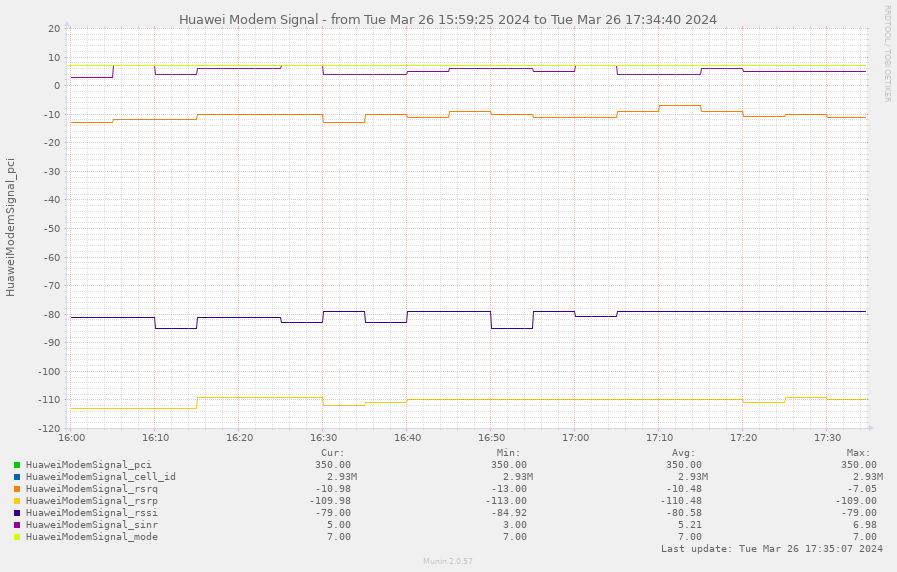

# muninHuaweiModemPlugin
<a href="http://munin-monitoring.org/">munin</a> plugin to log cell signal quality (rsrq, rsrp, rssi, sinr) from Huawei mobile modems (e.g. e3131 etc.) API.

## REQUIREMENTS
PHP (with curl extension).

## INSTALL
* set the modem IP (`$huaweiModemUrl = ` line).
* install in munin (and remember to restart munin-node -HUP afterwards), wait for munin to regenerate png/htmls.
* have fun! (Use munin's Limit low/high for better visuality.)
* add optional cron entry to log CellID changes (adjust paths to your install location and frequency to your taste)
```
1 * * * * echo "`date +\%Y\%m\%d-\%H\%M` - `/var/www/html/huaweimodem/huaweiModemLogCellID.php`" >> /var/www/html/huaweimodem/log/huaweiModemLogCellID.log
```


